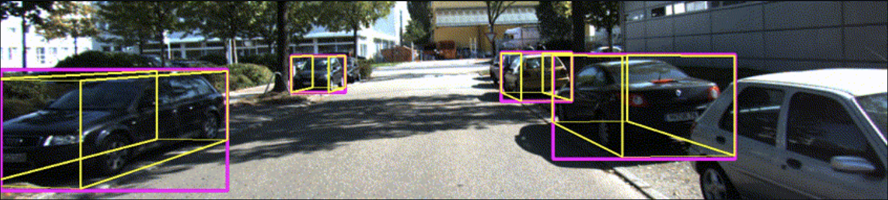

# Mono3D



## Training Schedule

```bash
# copy mono 3D example config
cd config
cp Yolo3D_example $CONFIG_FILE.py

## Modify config path
nano $CONFIG_FILE.py
cd ..

## Compute image database and anchors mean/std
# You can run ./launchers/det_precompute.sh without arguments to see helper documents
./launchers/det_precompute.sh config/$CONFIG_FILE.py train
./launchers/det_precompute.sh config/$CONFIG_FILE.py test # only for upload testing

## train the model with one GPU
# You can run ./launchers/train.sh without arguments to see helper documents
./launchers/train.sh  --config/$CONFIG_FILE.py 0 $experiment_name # validation goes along

## produce validation/test result # we only support single GPU testing
# You can run ./launchers/eval.sh without arguments to see helper documents
./launchers/eval.sh --config/$CONFIG_FILE.py 0 $CHECKPOINT_PATH validation/test
```

## Testing
<p align = "center">

</p>
